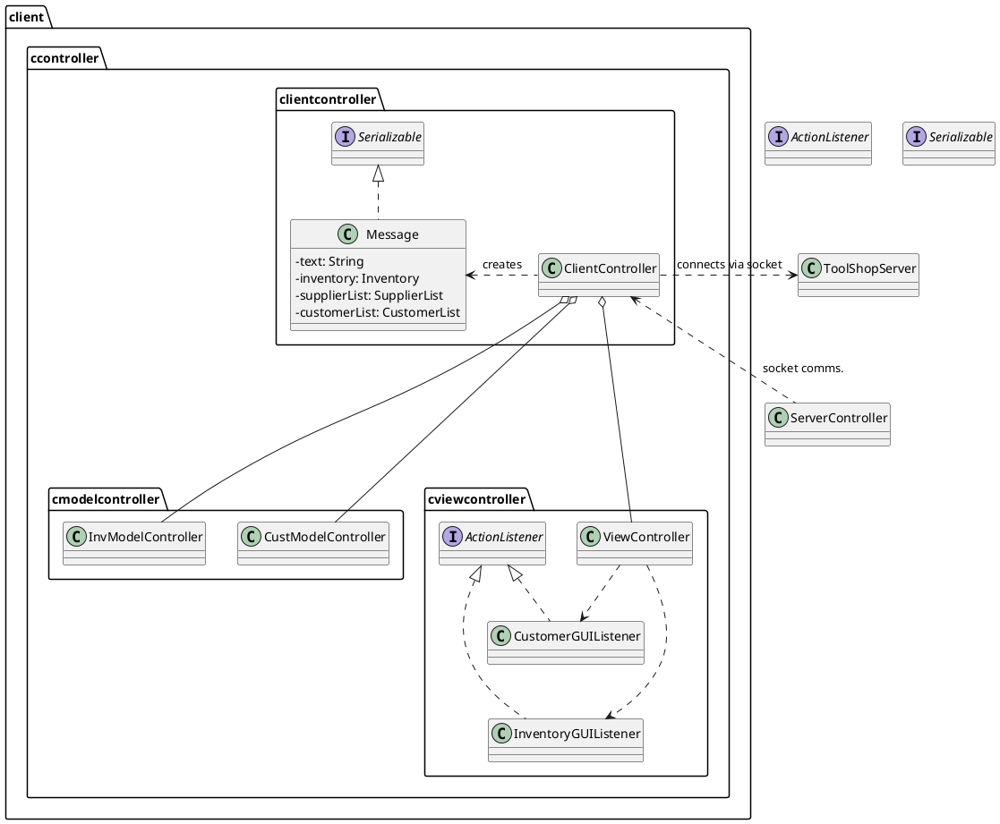
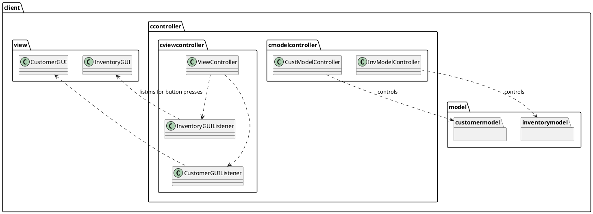

# Toolshop Project - ENSF 607/608
UML diagram name: Client UML 
 
Created by: Patrick Linang
 
Course: ENSF 607

## UML Diagram for client.ccontroller
## PlantUML code

## UML Diagram for client.cmodel and client.cview
## PlantUML code
