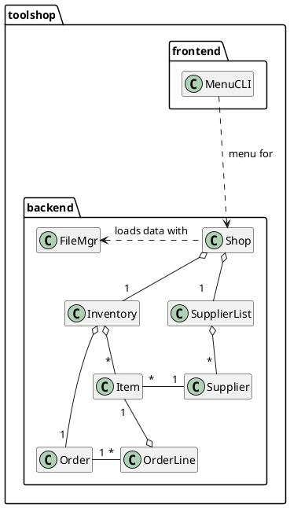

# Lab 3 Task 1 UML Diagram
Created by: Patrick Linang

Below is my updated UML diagram which is based on the UML discussed in lecture.
My program for this task uses this class design rather than my design from the
previous lab.

## UML Diagram for Tool Shop App

## PlantUML code for creating UML
