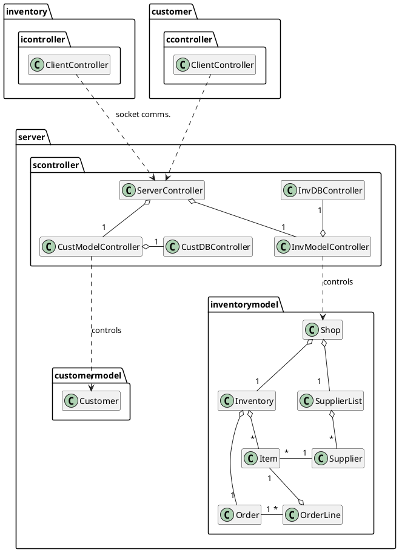

# Toolshop Project - ENSF 607/608
UML diagram name: Inventory Management System UML 
 
Created by: Patrick Linang
 
Course: ENSF 607

This UML captures the inventory package and the 

## UML Diagram for Inventory Management System
## PlantUML code
