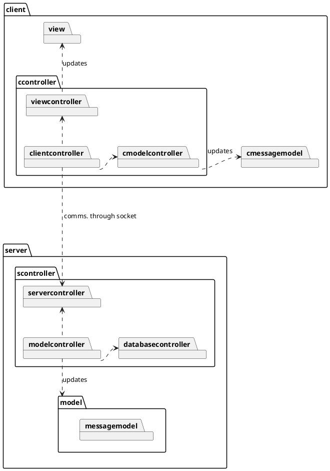

# Tool Shop Project - ENSF 607/608
UML diagram name: Main Tool Shop UML 
 
Created by: Patrick Linang
 
Course: ENSF 607

This UML represents the overall higher-level design of the tool shop system

## UML Diagram for Tool Shop System
## PlantUML code
