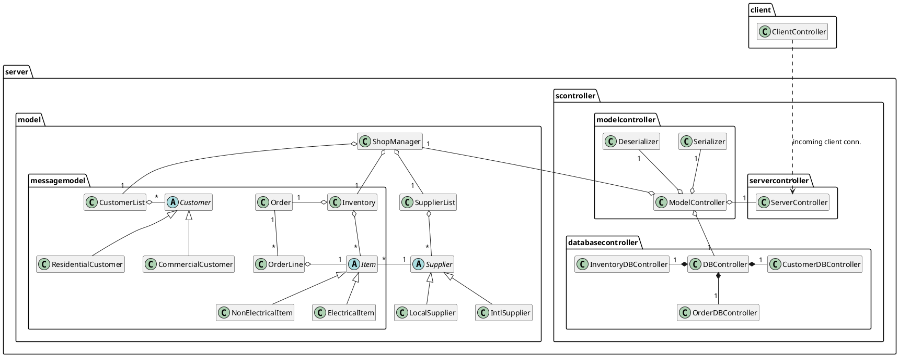

# Toolshop Project - ENSF 607/608
UML diagram name: Server UML 
 
Created by: Patrick Linang
 
Course: ENSF 607

## UML Diagram for server
## PlantUML code

```plantuml
@startuml
skinparam classAttributeIconSize 0

package server {
    package scontroller {
        package servercontroller {
            class ServerController {
                -controllerPool: ExecutorService
                -serverSocket: ServerSocket
                +runServer(): void
                +executeNewController(): void
            }
        }

        package modelcontroller {
            class Serializer
            class Deserializer
            class ModelController {
                -clientSocket: Socket
                -socketIn: ObjectInputStream
                -socketOut: ObjectOutputStream
                -inventoryController: InvModelController
                -customerController: CustModelController
                +createMessage(): Message
                +sendMessage(message: Message): void
                +readMessage(message: Message): void
                +run(): void
            }
        }
        
        package databasecontroller {
            class DBController {
                +readFromDB(tableName: String, query: String): LinkedHashSet<String>
                +updateDB(tableName: String, query: String): void
                +insertToDB(tableName: String, query: String): void
                +deleteFromDB(tableName: String, query: String): void
            }
            class InventoryDBController
            class CustomerDBController
            class OrderDBController
        }
    }

package model {
     package messagemodel {
            class CustomerList {
                -customers: LinkedHashSet<Customer>
                +addNewCustomer(customer: Customer): void
                +updateExistingCustomer(customer: Customer): void
                +removeCustomer(customer: Customer): void
                +searchCustomer(id: int): Customer
                +searchCustomer(name: String): Customer
                +searchCustomer(type: char): Customer
            }
            abstract class Customer {
                - clientId: int
                - firstName: String
                - lastName: String
                - address: String
                - postalCode: String
                - phoneNum: String
                - customerType: char
            }
            class ResidentialCustomer extends Customer
            class CommercialCustomer extends Customer
     
            class Inventory
            class Order
            class OrderLine

            abstract class Item
            class ElectricalItem extends Item
            class NonElectricalItem extends Item
    }

    class ShopManager
    class SupplierList
    
    abstract class Supplier
    class IntlSupplier extends Supplier
    class LocalSupplier extends Supplier


    }

}
    /' modelcontroller '/
    ShopManager "1" --o ModelController

    ServerController " 1   " -o ModelController
    ModelController o-- "1 " DBController
    Deserializer "1" --o ModelController 
    Serializer "1 " --o ModelController
    client.ClientController ...> ServerController : incoming client conn.
 
    
    /' databasecontroller '/
    InventoryDBController "1" -* DBController
    DBController *- "1" CustomerDBController
    DBController *-- "1" OrderDBController


    
    /' model '/
    ShopManager o-- "1" CustomerList
    ShopManager o-- "1" Inventory
    ShopManager o-- "1   " SupplierList

    SupplierList o-- " * " Supplier
    Item "*" - "1" Supplier : "        "

    Inventory o-- " * " Item
    Order "1" -o Inventory : "         "
    CustomerList o- " * " Customer
    Order "1" -- " * " OrderLine
    OrderLine o- "1" Item : "             "

hide members
@enduml
```