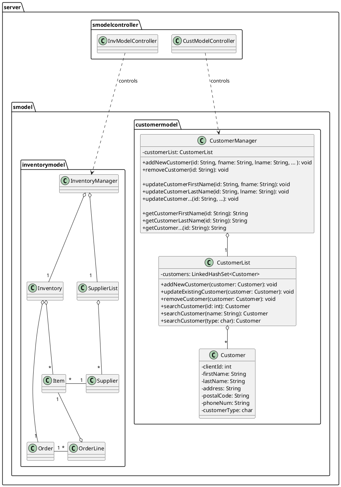
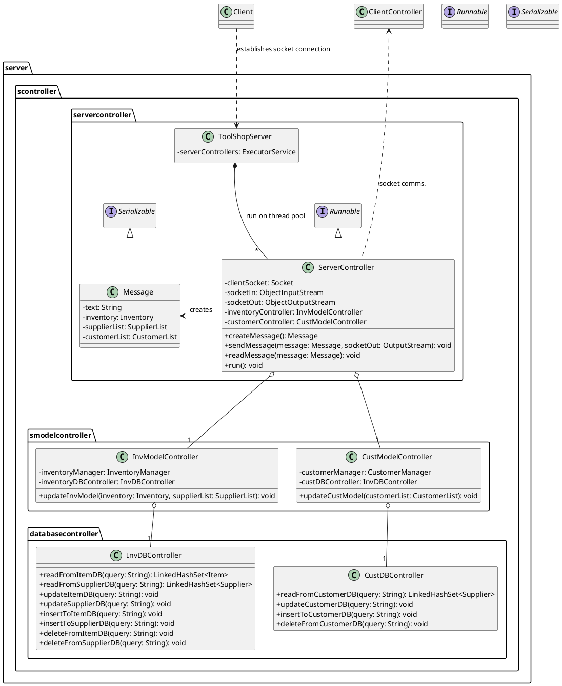

# Toolshop Project - ENSF 607/608
UML diagram name: Server UML 
 
Created by: Patrick Linang
 
Course: ENSF 607

This UML captures the class diagram for the server-side of the system and the  

## UML Diagram for server.smodel
## PlantUML code

## UML Diagram for server.sconntroller
## PlantUML code
